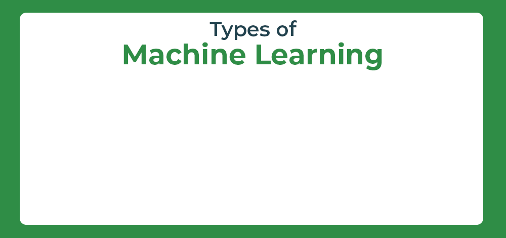
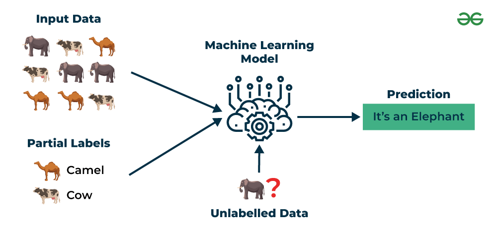
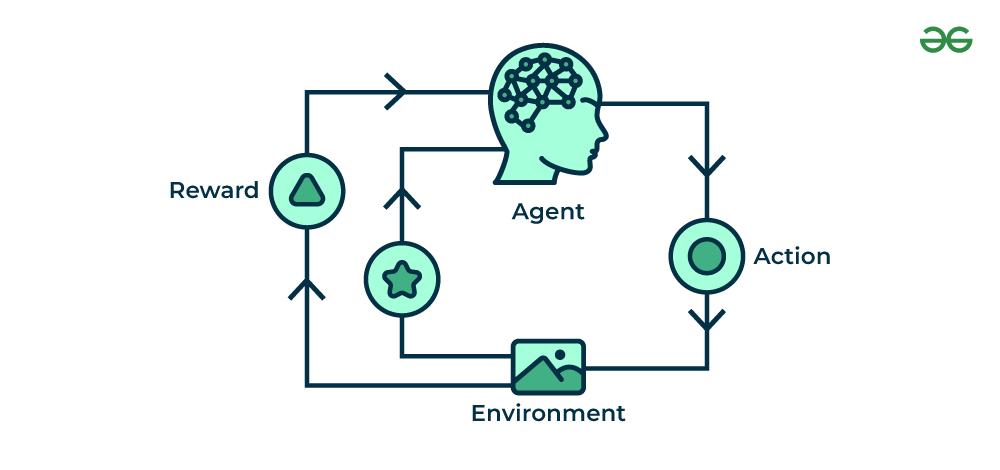

# Notes

## What is Machine Learning ??

 

+ Machine Learning is the field of study that gives computers the capability to learn without being explicitly programmed. 

+ ML is one of the most exciting technologies that one would have ever come across.

+ As it is evident from the name, it gives the computer that makes it more similar to humans: The ability to learn.

### Some Of Basic Defination

**Training:**

+ Act of combining data with (hyper) parameters to yield a model

**Model:** 

+ A deployable (usually binary) artefact that is the result of training. Can be used at runtime to make predictions for example

**Hyper-parameter:**  

+ Parameters used during training of a model, typically set by a data scientist/human

**Parameter:** 

+ A configuration variable set after the training phase (usually part of a model)

**Endpoint:** 

+ Typically a model is deployed to an endpoint which may be a HTTPS service which serves up predictions (models may be also deployed to devices and other places)

**Training Pipeline:** 

+ All the steps needed to prepare a model

**Training set:** 

+ A set of example data used for training a model

## Types of Machine Learning

+ There are several types of machine learning, each with special characteristics and applications. 

+ Some of the main types of machine learning algorithms are as follows:

1. Supervised Machine Learning
2. Unsupervised Machine Learning
3. Semi-Supervised Machine Learning
4. Reinforcement Learning

## 1. Supervised Machine Learning

 

+ Supervised learning is defined as when a model gets trained on a “Labelled Dataset”. 
+ Labelled datasets have both input and output parameters. 
+ In Supervised Learning algorithms learn to map points between inputs and correct outputs. 
+ It has both training and validation datasets labelled.

+ There are two main categories of supervised learning that are mentioned below:

1. Classification
2. Regression

**1. Classification :** 

+ Deals with predicting categorical target variables, which represent discrete classes or labels. For instance, classifying emails as spam or not spam.

**2. Regression:**

+ Deals with predicting continuous target variables, which represent numerical values. For example, predicting the price of a house based on its size, location, and amenities

### Advantages of Supervised Machine Learning

+ Supervised Learning models can have high accuracy as they are trained on labelled data.

+ The process of decision-making in supervised learning models is often interpretable.

+ It can often be used in pre-trained models which saves time and resources when developing new models from scratch.

### Disadvantages of Supervised Machine Learning

+ It has limitations in knowing patterns and may struggle with unseen or unexpected patterns that are not present in the training data.

+ It can be time-consuming and costly as it relies on labeled data only.

+ It may lead to poor generalizations based on new data.

### Applications of Supervised Learning

+ Speech recognition: convert speech to text

+ Predictive analytics: Predict outcomes, such as sales, customer churn, and stock prices

+ Weather forecasting: Make predictions for temperature, precipitation, and other meteorological parameters

+ Email spam detection: Classify emails as spam or not spam.

+ Recommendation systems: Make personalized recommendations to users.

## 2. Unsupervised Machine Learning

 

+ Unsupervised Learning Unsupervised learning is a type of machine learning technique in which an algorithm discovers patterns and relationships using unlabeled data. 

+ Unlike supervised learning, unsupervised learning doesn’t involve providing the algorithm with labeled target outputs. 

+ The primary goal of Unsupervised learning is often to discover hidden patterns, similarities, or clusters within the data, which can then be used for various purposes,   such as data exploration, visualization, dimensionality reduction, and more.

+ There are two main categories of unsupervised learning that are mentioned below:

1. Clustering
2. Association

**1. Clustering:**

+ Clustering is the process of grouping data points into clusters based on their similarity. 

+ This technique is useful for identifying patterns and relationships in data without the need for labeled examples.

**2. Association:**

+ Association rule learning is a technique for discovering relationships between items in a dataset. 

+ It identifies rules that indicate the presence of one item implies the presence of another item with a specific probability.

### Advantages of Unsupervised Machine Learning

+ It helps to discover hidden patterns and various relationships between the data.

+ Used for tasks such as customer segmentation, anomaly detection, and data exploration.

+ It does not require labeled data and reduces the effort of data labeling.

### Disadvantages of Unsupervised Machine Learning

+ Without using labels, it may be difficult to predict the quality of the model’s output.

+ Cluster Interpretability may not be clear and may not have meaningful interpretations.

### Applications of Unsupervised Learning

+ Clustering: Group similar data points into clusters.

+ Market basket analysis: Discover associations between products.

+ Recommendation systems: Suggest products, movies, or content to users based on their historical behavior or preferences.

+ Customer behavior analysis: Uncover patterns and insights for better marketing and product recommendations.

+ Content recommendation: Classify and tag content to make it easier to recommend similar items to users.

## 3. Semi-Supervised Learning

 

+ Semi-Supervised learning is a machine learning algorithm that works between the supervised and unsupervised learning so it uses both labelled and unlabelled data.

+ It’s particularly useful when obtaining labeled data is costly, time-consuming, or resource-intensive.

+ This approach is useful when the dataset is expensive and time-consuming.

+ Semi-supervised learning is chosen when labeled data requires skills and relevant resources in order to train or learn from it.

+ We use these techniques when we are dealing with data that is a little bit labeled and the rest large portion of it is unlabeled. 

+ We can use the unsupervised techniques to predict labels and then feed these labels to supervised techniques. 

+ This technique is mostly applicable in the case of image data sets where usually all images are not labeled.

+ Types Semi-Supervised Learning Methods

    
    + Graph-based semi-supervised learning
    
    + Label propagation
    
    + Co-training
    
    + Self-training
    
    + Generative adversarial networks (GANs)

### Advantages of Semi- Supervised Machine Learning

+ It leads to better generalization as compared to supervised learning, as it takes both labeled and unlabeled data.
 
+ Can be applied to a wide range of data.

### Disadvantages of Semi-Supervised Machine Learning

+ Semi-supervised methods can be more complex to implement compared to other approaches.

+ It still requires some labeled data that might not always be available or easy to obtain.

### Applications of Semi-Supervised Learning

    
+ Image Classification and Object Recognition
    
+ Speech Recognition
    
+ Recommendation Systems
    
+ Healthcare and Medical Imaging

## 4. Reinforcement Machine Learning

 

+ Reinforcement machine learning algorithm is a learning method that interacts with the environment by producing actions and discovering errors. 

+ Trial, error, and delay are the most relevant characteristics of reinforcement learning.

+ In this technique, the model keeps on increasing its performance using Reward Feedback to learn the behavior or pattern.

+ Each time we feed in data, they learn and add the data to their knowledge which is training data. So, the more it learns the better it gets trained and hence experienced.

+ most common reinforcement learning algorithms:

    
    + Q-learning  
  
       + Q-learning is a model-free RL algorithm that learns a Q-function, which maps states to actions. The Q-function estimates the expected reward of taking a particular action in a given state

    + SARSA (State-Action-Reward-State-Action)
     
      + SARSA is another model-free RL algorithm that learns a Q-function. However, unlike Q-learning, SARSA updates the Q-function for the action that was actually taken, rather than the optimal action.

    + Deep Q-learning
     
      + Deep Q-learning is a combination of Q-learning and deep learning. Deep Q-learning uses a neural network to represent the Q-function, which allows it to learn complex relationships between states and actions.

+ There are two main types of reinforcement learning:

    + **Positive reinforcement**

      + Rewards the agent for taking a desired action.
    
      + Encourages the agent to repeat the behavior.

    + **Negative reinforcement**

      + Removes an undesirable stimulus to encourage a desired behavior.

      + Discourages the agent from repeating the behavior.

### Advantages of Reinforcement Machine Learning

+ It has autonomous decision-making that is well-suited for tasks and that can learn to make a sequence of decisions, like robotics and game-playing.

+ This technique is preferred to achieve long-term results that are very difficult to achieve.

+ It is used to solve a complex problems that cannot be solved by conventional techniques.
    
### Disadvantages of Reinforcement Machine Learning

+ Training Reinforcement Learning agents can be computationally expensive and time-consuming.

+ Reinforcement learning is not preferable to solving simple problems.

+ It needs a lot of data and a lot of computation, which makes it impractical and costly.

### Applications of Reinforcement Machine Learning

+ Game Playing

+ Robotics

+ Natural Language Processing

+ Adaptive Personal Assistants

+ Agriculture

---