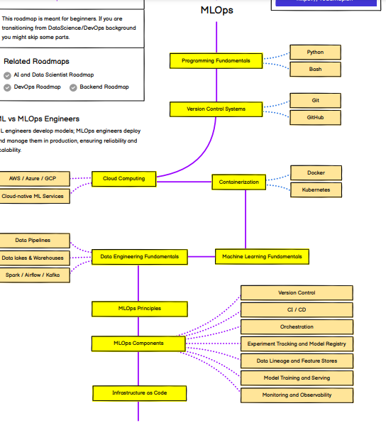
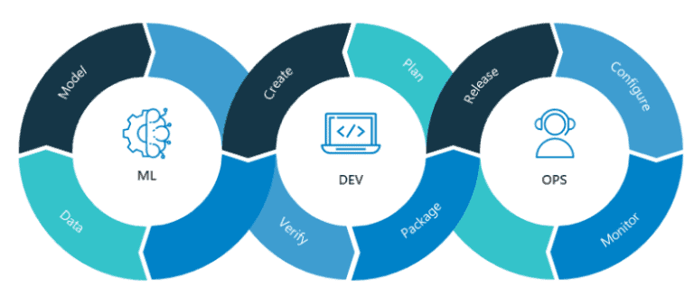
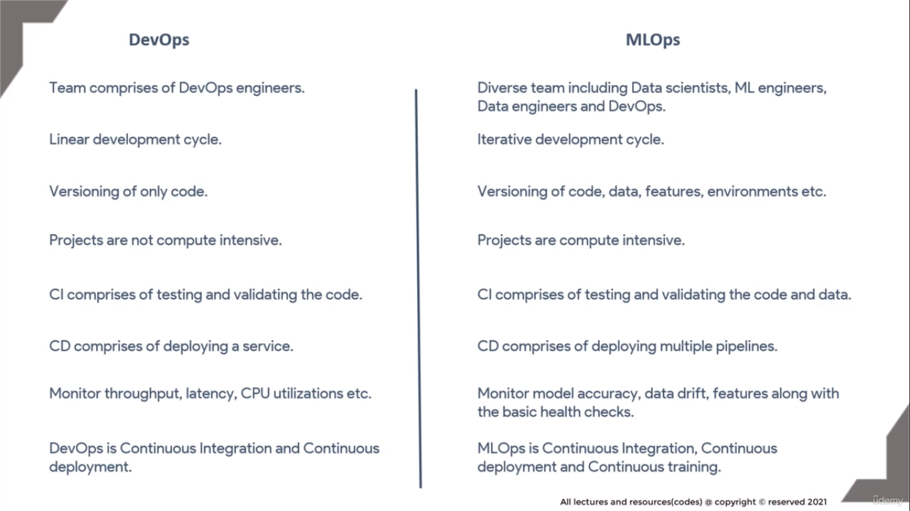
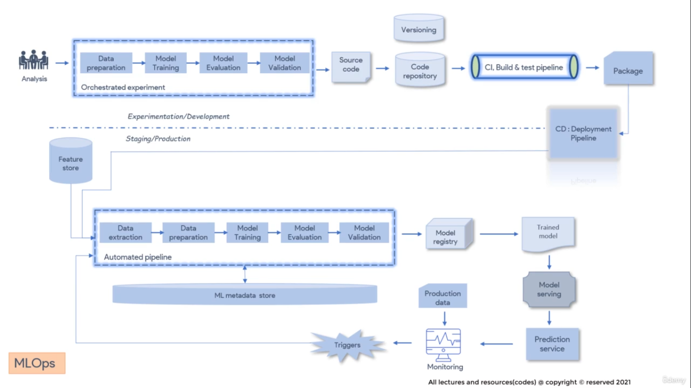

# Notes

## Road-map

## Things to Remeber While Learning 

+ A DevOps engineer considering a move to machine learning, here are some points to consider:

    + #### Start with the basics: 
    
        + Familiarize yourself with ML concepts, such as supervised and unsupervised learning, regression, and classification.
    
    + #### Focus on practical applications: 
        
        + Instead of delving deep into theoretical ML, focus on applying ML to DevOps-related problems, such as predictive maintenance or automated testing.
    
    + #### Develop skills in relevant tools and technologies: 
        
        + Learn popular ML frameworks like TensorFlow, PyTorch, or Scikit-Learn, and familiarize yourself with tools like Jupyter Notebooks or AWS SageMaker.
    
    + #### Network with ML professionals: 
        
        + Attend conferences, join online communities, or participate in meetups to learn from experienced ML practitioners and stay updated on industry trends.
    
 

+ By understanding the intersection of machine learning and DevOps, you can leverage the strengths of both fields to drive innovation and improvement in your organization.

## What is MLOps ??

 

+ MLOps focuses on Machine learning, DevOps, and data engineering, which directs toward the building, deploying, and maintaining Machine learning models in a production environment efficiently. 

+ We can consider MLOps as the process of automating machine learning operations using DevOps techniques.

## Difference between DevOps and MLOps

### Devops:-

+ DevOps facilitates a streamlined software development process for designing, testing, deploying, and monitoring any software application in production.

+ DevOps automates the deployment of software applications to production in just a few minutes to maintain them reliably

+ DevOps empowers various teams to execute their software applications in continuous integration and development mode.

+ DevOps bridge the gap between the development and deployment of application by proving automatic code quality checks, tests, and reliable deployment.

### MLOps:-

+ MLOps facilitates a streamlined ML model development process for feature engineering, model training, model deployment, and monitoring of any ML application.

+ MLOps automates the deployment of ML models in production in a faster way.

+ MLOps empowers data science and IT teams to connect, validate, and manage operations effectively.

+ MLOps bridge the gap between model training and deployment in production by automated model retraining,hyperparameter tuning, model assessment, and computing model drift.

#### NOTE: DevOps and MLOPs both focus on end-to-end process automation.

## MLOps main Tools

+ The main goal of MLOps is to develop and deploy Machine Learning (ML) models efficiently in a production environment. 

+ ML Model development needs lots of experiments like model retraining, hyperparameter tuning, model assessment, model drift, and model deployment. To track all of these things we need specialized tools.

+ Here are some of the most common types of tools used in MLOps:

1. **Track ML Experiments:**

    +  For experimentation purposes, we can use tools such as MLlow, ClearML, Neptune, Weights & Biases, and Comet. 
    
    + MLFlow and ClearML are full machine learning life cycle tools. Weights and Bias tracks and visualize the experiments. Neptune is an experiment tracker and model registry.

2. **Containerization:** 

    + For containerization purposes, we can use tools such as Docker, Kubernetes, and other cloud services such as AKS(Azure Kubernetes Service), GKE(Google Kubernetes Engine), and Amazon EKS. 
    
    + Both Docker and Kubernetes are containerization tools used for automating deployment, scaling, and management of containerized applications.
    
3. **CI/CD Pipeline:** 
    
    + For CI/CD purposes, we can use tools such as Jenkins, CircleCI, and GitLab. Jenkins is an open-source continuous integration and delivery tool. 
    
    + GitLab is a complete platform for version control, issue tracking, code review, and CI/CD. 
    
4. **Monitoring:** 

    + For monitoring purposes, we can use Fiddler and great expectations. Fiddler is a machine learning model monitoring and Great expectations is a data monitoring tool.
    
5. **Workflow Management Tool:** 
    
    + For managing workflows, we can use Airflow and Luigi. Airflow is used for scheduling and managing workflows. Luigi is used for complex data pipelines for batch jobs.

## Define Standards/Principles (Core Idea for MLOps)

### 1. Transition Friction :

+ Use notebooks templates that define common functionality eg. database connection template , fetching data etc.

+ Proper documentation.

### 2. Version control system :

+ Version control system for code, data, environments and artifacts.

### 3. Performance :

+ Leverage distributed computing and containerization tools e.g. Docker, Kubernetes.

### 4. Automation :

+ Build workflows, CI/CD pipelines.

+ MLOps is pipeline centric. Put pipelines in production than putting a model.

### 5. Monitoring :

+ Powerful innovative monitoring tools to monitor data, features, distribution, latency, uptime, Memory utilization etc.

+ Monitorting tools like Prometheus, Grafana

### 6. Continuous Training 

+ Automated retraining of models based on triggers or regular frequency.

 

## Who gets Benifited from MLOps

+ **Data Scientists** can now foucs more on research and experimentaion while having the overall visibility of their deployed data.

+ **ML Engineers** gets less resistance from understanding the experiment. Reproductibility is no longer a problem.

+ **Application developers** do not need to change the code every time , the model is changed. Model and application are decoupled from each other.

+ **Risk & Compliance team** gets benifited as MLOps infrastructure allows to steamline the internal processes. Since complete lineage is maintained so auditing process is smooth.

+ **Clients** can make better business decisions when they always have the updated model giving predictions.

## Basic Overview of Maurity Level of model in MLOps Azure

|Level | Description | Highlights | Technology |
|------|-------------|------------|------------| 
0	|No MLOps	|Difficult to manage full machine learning model lifecycle   The teams are disparate and releases are painful   Most systems exist as "black boxes," little feedback during/post deployment| Manual builds and deployments  Manual testing of model and application  No centralized tracking of model performance  Training of model is manual|
1	|DevOps but no MLOps |Releases are less painful than No MLOps, but rely on Data Team for every new model  Still limited feedback on how well a model performs in production  Difficult to trace/reproduce results | Automated builds  Automated tests for application code |
2	|Automated Training	|Training environment is fully managed and traceable  Easy to reproduce model  Releases are manual, but low friction| Automated model training  Centralized tracking of model training performance  Model management |
3	|Automated Model Deployment	|Releases are low friction and automatic  Full traceability from deployment back to original data  Entire environment managed: train > test > production| Integrated A/B testing of model performance for deployment  Automated tests for all code  Centralized tracking of model training performance|
4	| Full MLOps Automated Operations| Full system automated and easily monitored  Production systems are providing information on how to improve and, in some cases, automatically improve with new models  Approaching a zero-downtime system |Automated model training and testing  Verbose, centralized metrics from deployed model|

---

## Maurity Level 0(ad-hoc)

**Manual Processes:** 

+ No formalized workflows for developing, training, or deploying ML models. Everything is done manually.

**Isolated Workflows:** 

+ Models are built and deployed without standard practices or tools. Typically, work is done on an individual basis.

**Lack of Tracking:** 

+ No formal tools or systems for tracking experiments, versions, or model performance.

**No Automation:**

+ No automated pipelines or scripts; tasks are performed manually.
Level

## Maurity Level 1 (Basic Automation [Devops but no MLops])

**Scripted Workflows:**

+ Basic automation of ML processes using custom scripts (e.g., for training and deploying models).

**Version Control:**

+ Introduction of version control systems (like Git) for managing code and sometimes models.

**Experiment Tracking:**

+ Basic tracking of experiments using simple tools or platforms.

**Basic CI/CD Pipelines:**

+ Initial implementation of CI/CD pipelines, mostly for code, with limited integration for ML models.

## Maurity Level 2: Defined Processes (Automated Training)

**End-to-End Pipelines:**

+ Implementation of structured, end-to-end pipelines for data preparation, model training, and deployment.

**Automated CI/CD:**

+  CI/CD pipelines are established for both code and ML workflows, improving deployment automation.

**Model Registry:**

+ Use of a model registry to manage and version models, improving model governance.

**Basic Monitoring:**

+ Introduction of basic monitoring tools for model performance and operational metrics.

## Maurity Level 3: Managed and Optimized (Automated Training Deployment)

**Integrated Pipelines:**

+ Advanced, automated pipelines with integrated data ingestion, feature engineering, model training, validation, and deployment.

**Continuous Monitoring and Retraining:**

+ Automated monitoring for model performance and data drift, with mechanisms for automated retraining.

**Governance and Compliance:**

+ Implemented policies for model governance, compliance, and auditing.

**Enhanced Collaboration:**

+ Improved collaboration tools and practices, including shared environments and versioned artifacts.

## Maurity Level 4: Scalable and Innovative (Full MLOps Automated Operations)

**Advanced Integration:**

+ Seamless integration of ML workflows with broader DevOps practices and tools for end-to-end management.

**AIOps:**

+ Utilization of AI-driven operations for proactive monitoring, management, and optimization of ML models and infrastructure.

**Adaptive Systems:**

+ Models and systems are adaptive with self-healing capabilities to handle anomalies and optimize performance autonomously.

**Global Scalability:**

+ Solutions are designed for global scalability, with high availability and fault tolerance.

**Advanced Analytics:**

+ In-depth analytics for detailed insights into model performance, business impact, and operational efficiency.

## MLOps Stack

### What is MLOps Stacks?

+ With MLOps Stacks, the entire model development process is implemented, saved, and tracked as code in a source-controlled repository. 

+ Automating the process in this way facilitates more repeatable, predictable, and systematic deployments and makes it possible to integrate with your CI/CD process. 

+ Representing the model development process as code enables you to deploy the code instead of deploying the model. 

+ Deploying the code automates the ability to build the model, making it much easier to retrain the model when necessary.

